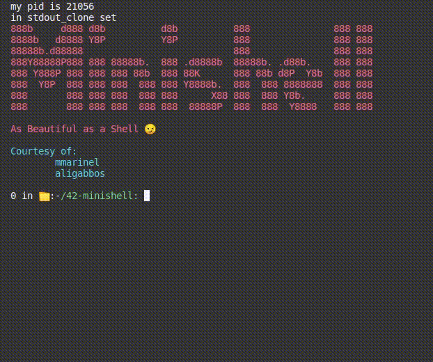
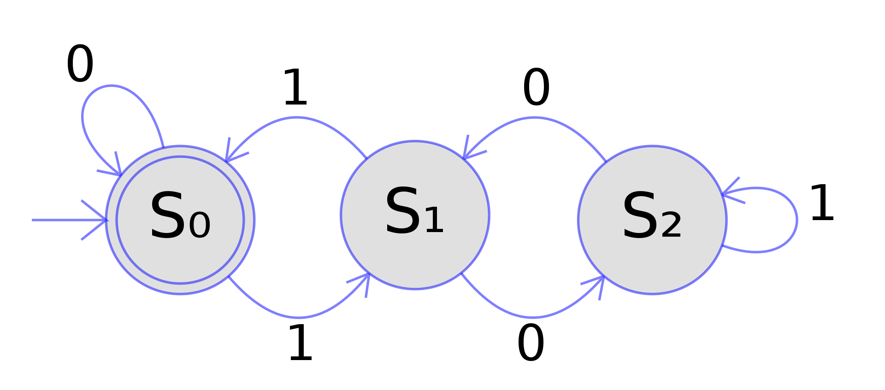
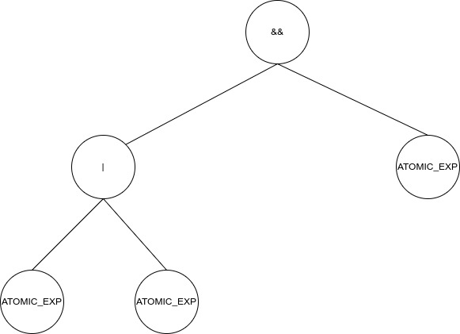
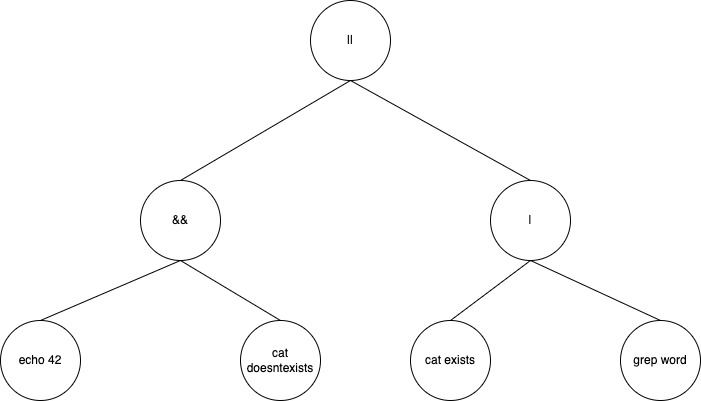

# minishell

minishell Project -42RomaLuiss

- Project done in collaboration with : gsemerar ([aligabbos](https://github.com/aligabbos))
- guide peer-reviewed (typos, mispelled words, etc.) by: dmedas ([VigorNuminis](https://github.com/VigorNuminis))

Minishell is a project about creating a simple shell.</br>
This simple shell should faithfully emulate a small subset of bash. But how to define such a subset? Go on and read [en.subject.pdf](en.subject.pdf) present in this directory for a detailed explanation of the project.

Both Bonus and Mandatory part are implemented in our project.

grade 125/100



# How we did it

We adopted a [REPL](https://en.wikipedia.org/wiki/Read%E2%80%93eval%E2%80%93print_loop) (Read-Evaluate-Print Loop) approach to solve this problem.
Therefore, there are three main components that make up our program:

1. **read module**
2. **execute module**
3. **print module** (this one being incorporated in the execute module)

We will go through each one of these to explain our thought process.</br>
A module can in turn be made of a small number of other submodules: we'll also go through each one of these in the order they are used by the given module.

### Table of contents

1. [Special Environment variables](README.md#special-environment-variables)
   - [Getting the pid without using getpid()](README.md#getting-the-pid-without-using-getpid)
2. [The Read module](README.md#the-read-module)
3. [The Execute module](README.md#the-execute-module)
4. [The Print module](README.md#the-print-module)
5. [Special Behaviours](README.md#special-behaviours)
   - [Inception](README.md#inception)
   - [env](README.md#env)

**Reminder**: This is a very short introduction on the project. There is a lot to talk about and I'm afraid I won't be able to go through everything. Also, the code has been developed on MacOS systems: you may need to make some code changes before you can execute the project on your machine (You probably need to change the path to the readline library inside the Makefile too).</br>I'm only a student who's passionate about theoretical concepts that lie behind the code we write, so do not take this guide as the ultimate truth. Further, this one here is not to be intended as guide on the project, but rather as an introduction to formal language theory and parsing, which are pretty complex subjects in computer science.</br>This may not be the fastest way to do the project, but it certainly is a way that will bring you knowledge about interesting topics.

## Special Environment variables

By requisites, we have to handle environment variables, both non-special and special ones. Now, the only explicit request about special variables is to implement the `$?` variable, but we also chose to implement the `$$` variable.

- `$?`: This variable holds the return value of the last executed foreground pipeline. In our code, it is given the name `last_executed_cmd_status`, due to the fact that the return value of the last executed command is equivalent to that of the last executed foreground pipeline, because the return of a pipeline is always the return value of its last executed (most of the times rightmost) command.

- `$$`: This variable holds the PID (process identifier) of the current shell. This variable can be a little bit tricky to implement because of the double $ sign; when we scan --variables, commands, etc.-- in fact, the $ sign is generally the delimiting character.

### Getting the pid without using getpid()

Now, the [en.subject.pdf](en.subject.pdf) prohibits the use of the [`getpid()`](https://man7.org/linux/man-pages/man2/getpid.2.html) function in order to take the PID of the current shell. Maybe, that's a sign we shouldn't implement this functionality at all, but we could not be discouraged about implementing what we think is such an interesting addition to our project.

So, how do we circumvent this need for using the getpid() function? Easy, we [fork](https://man7.org/linux/man-pages/man2/fork.2.html) our program so that the parent process can get the PID of its child process and pass it to it through a pipe. Now, the child process will become the real minishell process while the parent will just take the mere role of a "program launcher" and [wait](https://man7.org/linux/man-pages/man2/wait.2.html) for the child to terminate (and, after that, pick its return value and give it as an argument to the [exit](https://man7.org/linux/man-pages/man3/exit.3.html) function, so that the original caller can read it while the parent terminates its execution).

There's only one problem: executing the little piece of code responsible for this functionality may cause the leaks program to detect memory leaks on your machine. Do not fear them, these are false positives! In fact, we do not dynamically allocate any memory inside the function responsible for such functionality (please verify it by yourself) and simply commenting the call to it is enough to remove any memory leak detected by the leaks program.

## The read module

The read module is concerned with reading the input correctly and transforming it in an equivalent but unambiguously interpretable structure (more on this in the parser sub-module).

The read module is constituted of three sub-modules:

1. [Prompt](README.md#the-prompt-module)
2. [Tokenizer](README.md#the-tokenizer-module)
3. [Parser](README.md#the-parser-module)
   - [Grammars](README.md#grammars)
   - [Our Gramamr](README.md#our-grammar)
   - [Our Parser](README.md#our-parser)

### The Prompt module

This sub-module is concerned with the input-taking part of the read module. We call this sub-module the "Prompt module" even though the prompt is nothing but a mere manifestation, if you will, of being inside such module. The prompt is that beautiful greeting that tells you the shell is read to take your input. So, we should really call this module "The interactive mode module" or again "The input taking module", but these are too long and too complicated names. <<But there's a simpler and more suitable name>> you'd say, I'll still tell you I'd keep this one because I like the evocative power of it.

Now, let's get to the point.

The prompt module is all about taking input with respect to the following rules:

1. **handling here_doc**: _Here_doc_ is a special way of providing input to your commands by using the special `<<` redirection symbol. This is different from the input redirection symbol `<` which requires you to specify the name of a "file" where to take input from. With the Here\*doc you don't have to specify the name of a file but you still have to specify something, what then? The so called _delimiter_ . What the here_doc does is that it opens another process which changes prompt (so to communicate to you that you are now in "here_doc mode") and waits for your input. Here_doc doesn't stop reading input (line by line) until you either type the delimiter you chose or you press ctrl+D (which "signals" no more input from stdin). Once Here_doc is done reading input, it puts it in a hidden file for later use by the commands (or program) you specified to be executed on such input. So, code wise, this is equivalent to an input redirection `<` with the only added difficulty of having to open another subprocess, use pipes to communicate with its parent process and interpreting the name of the file differently. You can see all of this inside the respective function in the "Tokenizer" module. We decided to spawn another subprocess for handling the here_doc mode, because pressing ctrl+D invalidates our stdin, but the consequences of it should only be to stop filling the here_doc content. Thus, we [fork](https://man7.org/linux/man-pages/man2/fork.2.html) our process so to work on separate stdins.

2. **handling line completion**: When you type an uncompleted line, meaning a line that ends with a logical operator (&&, ||, |), your minishell should be able to continue taking input until the line gets completed. We meet this goal by opening another subprocess that changes prompt (so to communicate to you that you are now in "line completion mode") and waits for input until the line gets completed. We decided to spawn another subprocess for many reasons, one of these being that, while in "line completion prompt", the behavior of signal handling changes. While pressing ctrl+C in the main shell causes the prompt to read a new line, pressing ctrl+C in line completion mode causes the "input taking process" to stop and the whole taken input to be forgotten(\*) (the only thing in common with pressing ctrl+C while in the main shell is that this causes the `$?` variable to be set to 1, indicating a general error). If we instead press ctrl+D in an empty line while in line completion mode, then the process stops but the input is not forgotten; instead, it is taken (concatenating each line read) and sent to the parser. Now, having stopped the line completion process, we end up with an invalid (syntactically) line. This means that the parser will throw a parse error (error code `258`), which is different from a general error returned by many other minishell projects. Parsers can throw errors too, i.e. parse/syntax errors!.
   We decided to throw parse errors also for unbalanced lines (i.e.: lines with unbalanced parenthesis or with pending quotes) because trying to use the line completion process with this kind of lines would imply handling the `;` symbol. Bash, for some weird reason in fact, puts a `;` symbol at the end of each read line before the closing `)` is found. By requisites, we don't have to handle the `;` symbol (read [en.subject.pdf](en.subject.pdf)), so we can't handle this case.

Now, we actually enclosed the Here_Doc process inside the line completion process. The reason for this being that, within every newly typed line while in line completion prompt, we can put as many `<<` redirections as we like. Thus, we have to make sure to capture every Here_Doc while reading lines during the line completion process.

(\*)Forgotten lines are called like so not only because we don't actually process them (i.e.: feed them to the parsing unit and so forth), but also because we don't save them in our history of previously typed commands (bash compliant) like all other typed lines must be (except here_doc content)

### The Tokenizer module

The Tokenizer module is concerned with transforming the input sequence into a stream of tokens. Tokens are defined as the significant (i.e.: they bear semantics) atomic parts which make up our input. They are a sequence of characters having a collective meaning. Tokens are the keywords of our language (in our case bash), the identifiers, the literals (constants), the operators and the punctuators (parenthesis, semicolon, etc). Not everything is a token though, white spaces are not because they don't bear semantics even though they act as separators for our tokens. On this regard, I suggest you take a little moment to go and take a look at this funny [esoteric programming language](https://en.wikipedia.org/wiki/Esoteric_programming_language) called [Whitespace](<https://en.wikipedia.org/wiki/Whitespace_(programming_language)>), which reverts this trend: in this language, only whitespaces have semantics.

With respect to the subset of the bash language we have to implement, we identify the following tokens:

- **`e_CMD_NAME`**
- **`e_CMD_ARG`**
- **`e_IN_FILE_TRUNC`**
- **`e_HERE_DOC`**
- **`e_OUT_FILE_TRUNC`**
- **`e_OUT_FILE_APPEND`**
- **`e_OPERATOR`**: this includes the following operators: &&, ||, |.
- **`e_ENV_VAR_DECL`**: this includes a series of bindings of the kind \<var_name, var_val\>. We also call this an "env statement" as opposed to just typing, for instance, "export" which falls under the e_CMD_NAME token.
- **`e_ENV_VAR_UNSET`**
- **`e_PARENTHESIS`**

One thing to underline is that some of these tokens encapsulate information. We decided to do it this way in order to make the tokenizer and parser modules easier. For instance, all of the redirection tokens (e_IN_FILE_TRUNC, e_OUT_FILE_APPEND, etc) enclose the information about the file name where to take input from or send output to. Another example would be the e_CMD_ARG token, we always enclose all of the arguments to a given command inside this token so that we only need one token of this kind per command without further complicating the input scanning. And, finally, the e_ENV_VAR_DECL token; this token encapsulates a series of bindings as a list where each node contains the information about the specified variable name, the optional specified value and the information about wether this is a concatenation with the previously hold value or a variable re-definition.

Another thing we'd like to underline is that the input gets scanned in such a way to produce an "ordered" stream of tokens. By this we mean that the last token before an operator token is always a e_CMD_NAME token optionally followed by a e_CMD_ARG token. All of the redirection tokens relative to the command enclosed by the e_CMD_NAME token appear even before, because as we scan input we keep track of each redirection token we find.

Now, to recognize a part of the input as a token, we need a way to recognize patterns. Imagine for instance the following: `export a=42 b=44`. This should be recognized as a `e_ENV_VAR_DECL` token. We sketched a bunch of [finite state automata](https://en.wikipedia.org/wiki/Finite-state_machine) in order to solve this problem. A finite state automaton is just a [graph](<https://en.wikipedia.org/wiki/Graph_(discrete_mathematics)>) that, if read correctly, it provides an algorithm to "accept" a string as being part of those ones displaying a certain specific pattern. More precisely, finite state automata can be proved to be equivalent to regular grammars even though a finite state automaton can accept, rather than generate, a regular language.
What is a regular language? A regular language belongs to the highest class in the Chomsky hierarchy, but we'll talk about this in a moment.

Inside the tokenzier module, you will find our translation in code of the finite state automata we built. Below is an image of a simple finite state automaton to recognize the language of the binary numbers which are multiples of `3`.



In our tokenizer module, we defined a "tokenizer" object. This object (which is not an object in the OOP sense) provides a function to read the input and process it as a stream of tokens, a function to return the next unscanned token and a function to clean the current list of tokens.</br>We define this tokenizer object below

```
static void	*tokenizer(char *command_line, t_op_code op_code)
{
	static t_token	*token_list;
	static t_token	*cur_token = NULL;
	t_token			*token;

	if (op_code == e_READ_INPUT)
	{
		token_list = tokenize(command_line);
		cur_token = token_list;
	}
	if (op_code == e_NEXT_TOKEN)
	{
		token = cur_token;
		if (cur_token)
			cur_token = cur_token->next;
	}
	if (op_code == e_CLEAN)
	{
		free_tok_list(&token_list);
		cur_token = NULL;
	}
	return (token);
}

```

we only expose the functions which change its status

```
void	tokenizer_feed_input(char *command_line)
{
	if (command_line == NULL)
		return ;
	tokenizer(NULL, e_CLEAN);
	tokenizer(command_line, e_READ_INPUT);
}

t_token	*next_token(void)
{
	return (tokenizer(NULL, e_NEXT_TOKEN));
}

void	tokenizer_free(void)
{
	tokenizer(NULL, e_CLEAN);
}
```

The `tokenize` function is the one where the the tokenization process (i.e.: the input being transformed into a stream of tokens) starts from.</br>This function calls all the finite state automata we built to recognize patterns which define a token.

Now, once the tokenizer module has done its job, all we are left with is the stream of tokens which will be passed to the Parser module.</br>**Remember, from now on no more plain input! What we have now is a stream of tokens!**

### The Parser module

Remember when I said that the read module transforms our input sequence into an equivalent but unambiguously interpretable structure? Well, this structure happens to be a tree and this tree happens to be derived from a grammar which has tokens as its terminal symbols.

But wait, what do I mean by grammar? And what the heck is a "terminal symbol"?

#### Grammars
Before we can code up our parser, we need to understand exactly which subset of the bash language we're trying to parse.</br>Easy, you say, it's that subset which contains pipes and logical operators!</br>But can you define it formally, or more importantly, precisely?</br>In other words, can you define a way to describe or to generate all and only the strings which are part of the language we want to parse?

Remember, it's for you to see if you really understand the thing your about to do, but it's also mandatory since a calculator needs a formal and precise description of the language, if you want to code an algorithm to parse it!

A Grammar is a compact notation to describe a language. More precisely: given a target language, a grammar provides a finite description of how to generate all and only the sentences which are part of that language. We call the sentences belonging to a language strings. A language can have infinite strings of infinite length, but the grammar that generates it is always finite!

Grammars are made up of four components:

- **non-terminal symbols**: these symbols denote a class of sentences or words belonging to our language. Non-terminal symbols can group the class of all arithmetic expressions, or again the class of all valid identifiers, etc. Non-terminal symbols can be re-written in their atomic constituents (terminal symbols) using the rules of the grammar known as productions.

- **terminal symbols**: terminal symbols are the final symbols appearing in the sentences of our language. They are the atomic parts of a sentence that bear meaning. Therefore, they cannot be re-written using productions.

- **productions**: a production is a binary relation of finite cardinality defined on `(VT U VN)^* ° VN ° (VT U VN)^* X (VT U VN)^*`, where the \* symbol is the [kleen star operator](https://en.wikipedia.org/wiki/Kleene_star). Simply put, a production provides a rule telling you how to rewrite a sentence, with at least one non-terminal symbol, into another sentence made up of an arbitrary amount (even 0) of terminal and/or non-terminal symbols. One important thing to note is that a production is not a function, it is rather a mathematical relation because there can be several ways you can rewrite a sentence.

- **the Axiom**: A special non-terminal symbol. This is the symbol where to start the derivation process from. The derivation process is the process by which you can generate sentences of the target language. The derivation process starts with rewriting the Axiom with one of the many re-writing rules known as productions you have specified in your grammar.

One way of describing a grammar is by listing all of the production rules it defines. Each production rule has its left-hand side (the sentence to be re-written) separated by a `:-> ` symbol from its right-hand side.
For each of the re-writing rules for a given sentence, we may want not to waste lines, that's why we use the `|` character to separate re-writing rules with the same left-hand side when put on the same line. Non-terminal symbols are generally written ALL-CAPS while terminal symbols are written in lower case letters. Following, is an example of such descritpion, with `S` as the Axiom.

```
S :-> A
A :-> bB | aA
B :-> bbB | bb
```

Can you guess which language does this grammar generate?

One thing to note is that a grammar can generate only one language, that is why, from now on, we will use the term "grammar" and the term "language" interchangeably.

Now, there are several ways to classify grammars, one of those is to put additional constraints on how productions are defined so that you can define a class of related languages. The stricter these constrainst are, the higher up you go on the hierarchy of classes of grammars you are defining. This is known as the [Chomsky Hierarchy](https://en.wikipedia.org/wiki/Chomsky_hierarchy), by the name of the very famous philosopher who invented it and whose contribution to formal language theory, as well as many other fields of knowledge, have led us to great discoveries.

One of those classes defined in the Chomsky Hierarchy is the class of [**Context-free grammars**](https://en.wikipedia.org/wiki/Context-free_grammar). These grammars are the basis for almost every programming language, in the sense that if you pick any, it is very probable that it is defined wit respect to, and can be generated by, a context-free grammar.
</br>Context free grammars have this fancy name because you can replace a non-terminal symbol appearing in a sentence with every matching production rule, no matter where this non-terminal symbol appears. I.e.: They do not depend on the context!


Context free grammars are recursive in nature, so if you're asking why our parser uses recursion (as we will see shortly), that's because our language's grammar is recursive in nature!.
</br>**N.B.: C** is generated by a context-free grammar too!

Context free grammars are quite strict in the sense that they only admit productions of the kind

```
A -> γ
```

where `A` is a non-terminal symbol and `γ` is a non-emtpy sentence made up of terminal and/or non-terminal symbols.

The grammar we used to describe the subset of the bash language we had to implement is a context-free grammar and it is defined in the next chapter.

#### Our grammar

Following, is the grammar we wrote with the symbol `CMD_LIST` being given the role of Axiom.

```
CMD_LIST :-> LOG_CHAIN

LOG_CHAIN :-> LOG_CHAIN AND_SYM PIPE_CHAIN | LOG_CHAIN OR_SYM PIPE_CHAIN | PIPE_CHAIN

PIPE_CHAIN :-> ATOMIC_EXP PIPE_SYM PIPE_CHAIN | ATOMIC_EXP

ATOMIC_EXP :-> OPEN_PAREN CMD_LIST CLOSING_PAREN | STATEMENT

STATEMENT :-> REDIR STATEMENT | SIMPLE_CMD | ENV_STATEMENT


REDIR :-> e_IN_FILE_TRUNC | e_HERE_DOC | e_OUT_FILE_TRUNC | e_OUT_FILE_APPEND

SIMPLE_CMD :-> e_CMD_NAME | e_CMD_ARG e_CMD_NAME
ENV_STATEMENT :-> e_ENV_VAR_DECL | e_ENV_VAR_UNSET

AND_SYM :-> e_OPERATOR with a value of "&&"
OR_SYM :-> e_OPERATOR with a value of "||"
PIPE_SYM :-> e_OPERATOR with a value of "|"

OPEN_PAREN :-> e_PARENTHESIS with a value of "("
CLOSING_PAREN :-> e_PARENTHESIS with a value of ")"

```

As you can see, this grammar is a context-free grammar. We actually broke the rule of terminal symbols being written in lower case letters because we re-used the identifiers for tokens used inside our code.</br>(remember that our grammar generates the language of the sentences translated into tokens!)

Now, how can we use this grammar to generate the sentences of our language?

Well, let's first see an example

```
cat file | grep ciao && echo ciao
```

This input will be transformed by the tokenizer into the following stream of tokens

```
e_CMD_ARG e_CMD_NAME e_OPERATOR e_CMD_ARD e_CMD_NAME e_OPERATOR e_CMD_ARG e_CMD_NAME
```

Let's try to derive this sentence. We start from `CMD_LIST`, our axiom. Looking at the grammar, we immediately rewrite our axiom with the `LOG_CHAIN` symbol. From here, it is obvious that the only rule we can apply is the following one `LOG_CHAIN :-> LOG_CHAIN AND_SYM PIPE_CHAIN`, which will be rewritten as `PIPE_CHAIN AND_SYM PIPE_CHAIN` by rewriting the `LOG_CHAIN` symbol. Now, the first `PIPE_CHAIN` symbol will be rewritten as `ATOMIC_EXP PIPE_SYM PIPE_CHAIN`, which will finally be rewritten as `ATOMIC_EXP PIPE_SYM ATOMIC_EXP`, while the second one will be rewritten as `ATOMIC_EXP`. Putting everything together, we obtain `ATOMIC_EXP PIPE_SYM PIPE_CHAIN AND_SYM ATOMIC_EXP`, which will finally be rewritten as the stream of tokens above, thus proving the original sentence can be derived from our grammar!

The derivation process can be schematized in the following way

```
CMD_LIST ==> LOG_CHAIN
         ==> LOG_CHAIN AND_SYM PIPE_CHAIN
         ==> PIPE_CHAIN AND_SYM PIPE_CHAIN
         ==> ATOMIC_EXP PIPE_SYM PIPE_CHAIN AND_SYM PIPE_CHAIN
         ==> ATOMIC_EXP PIPE_SYM ATOMIC_EXP AND_SYM PIPE_CHAIN
         ==> ATOMIC_EXP PIPE_SYM ATOMIC_EXP AND_SYM ATOMIC_EXP
         ==> ...
         ==> SIMPLE_CMD PIPE_SYM SIMPLE_CMD AND_SYM SIMPLE_CMD
         ==> e_CMD_ARG e_CMD_NAME e_OPERATOR e_CMD_ARD e_CMD_NAME e_OPERATOR e_CMD_ARG e_CMD_NAME
```

What this derivation tells us is that the sentence we just derived is made up of three macro-components: a `PIPE_CHAIN` which is a series of simple commands separated by pipe symbols, a `&&` operator and then the final part which is also a `PIPE_CHAIN`. So, what this really tells us is that the most external operator (the one that gets evaluated the last) is the && operator and that it acts on the return value of its left-hand side and then eventually its right-hand side, which are both pipe chain of commands. Going further on, the processs tells us that the first `PIPE_CHAIN` is actually made of two simple commands separated by a pipe, instead the second one is just another simple command.

So, what a gramamr does is that it provides a structure for our sentences and a clear guidance on how to interpret them. If we didn't use the grammar, we would be stuck figuring out if the right way of interpreting the input was `cat file | (grep ciao && echo ciao)` (parenthesis act as mere separators here) or `(cat file | grep ciao) && echo ciao`. Having instead the grammar at hand, there is no way for misdirection as the only way to derive such sentence from it is to consider it as being the `&&` operation of a `PIPE_CHAIN` with another `PIPE_CHAIN`.

This interpretation can be visualized by using a tree where each node is either

- a node containing an operator (&&, ||, |) and two subtrees, left and right, containing the expressions on which such operator has to be evaluated
- a statement (SIMPLE_CMD, ENV_STATEMENT). These will be the leaves of our tree.

Following is the tree for the sentence interpreted above

|                                                                |
| :-----------------------------------------------------------------------------: |
| _We wil see in the execute module how trees make the evaluation process simple_ |

So, we can derive trees from grammars.</br>For each sentence in our language, we can derive at least one tree as we derive the sentence by applying our production rules.</br>But we said "at least"; in general, you may be able to derive multiple trees for the same sentence, thus leading to different interpretations. In this case, we say that our grammar is **ambiguous**.

Our gramamr is not ambiguous, as for each sentence there is only one tree we can derive.
</br>This is a desirable quality for grammars, as it leads to a unique, unambiguous, interpretation.

One further thing to specify, is that our grammar also works for cases like `echo ciao && cat filetto || echo salve` as the only way to derive such a sentence is the following

```
CMD_LIST ==> LOG_CHAIN
         ==> LOG_CHAIN OR_SYM PIPE_CHAIN
         ==> LOG_CHAIN AND_SYM PIPE_CHAIN OR_SYM PIPE_CHAIN
         ==> PIPE_CHAIN AND_SYM PIPE_CHAIN OR_SYM PIPE_CHAIN
         ==> ...
         ==> e_CMD_ARG e_CMD_NAME e_OPERATOR e_CMD_ARG e_CMD_NAME e_OPERATOR e_CMD_ARG e_CMD_NAME
```

which actually tells us that this is the `&&` operation of a `||` operation, of two simple commands, with another simple command.

And now, as a final example, let's see how sentences containing parenthesis can be derived from out grammar!<br/>Let's consider a variation of our first example
```
cat file | (grep ciao && echo ciao)
```

This sentence will be transformed in the following stream of tokens by our tokenizer

```
e_CMD_ARG e_CMD_NAME e_OPERATOR e_PARENTHESIS e_CMD_ARG e_CDM_NAME e_OPERATOR e_CMD_ARG e_CMD_NAME e_PARENTHESIS
```

The first rule we can apply after having rewritten our axiom, is the following one `LOG_CHAIN :-> PIPE_CHAIN` (try deriving the sentence with other rules, you can't), which will be rewritten as `ATOMIC_EXP PIPE_SYM PIPE_CHAIN` by rewriting the `PIPE_CHAIN` symbol. Now, the `ATOMIC_EXP` symbol will simply be rewritten as `SIMPLE_CMD` while the `PIPE_CHAIN` symbol will be rewritten as `ATOMIC_EXP`, which will in turn be rewritten as `OPEN_PAREN CMD_LIST CLOSING_PAREN`. It is easy now to see that these sentences will respectively be transformed as `e_CMD_ARG e_CMD_NAME` and `e_PARENTHESIS e_CMD_ARG e_CDM_NAME e_OPERATOR e_CMD_ARG e_CMD_NAME e_PARENTHESIS`, thus obtainining the original sentence above!

We can summarize the derivation process as follows

```
CMD_LIST ==> LOG_CHAIN
         ==> ATOMIC_EXP PIPE_SYM PIPE_CHAIN
         ==> SIMPLE_CMD PIPE_SYM PIPE_CHAIN
         ==> SIMPLE_CMD PIPE_SYM ATOMIC_EXP
         ==> SIMPLE_CMD PIPE_SYM OPEN_PAREN CMD_LIST CLOSING_PAREN
         ==> ...
         ==> e_CMD_ARG e_CMD_NAME e_OPERATOR e_PARENTHESIS e_CMD_ARG e_CDM_NAME e_OPERATOR e_CMD_ARG e_CMD_NAME e_PARENTHESIS
```

What this tells us it that the original sentence is a pipe operation of two expressions, with the first one being a simple command, while the second one being a logical chain of other simple commands!

#### Our Parser

We used a modified version of a recursive-descent top-down parser. For a reference, please watch this [video](https://youtu.be/SToUyjAsaFk) made by a Professor of Portland State University, which was the main source of inspiration for both my tokenizer and parser modules.

A top-down parser is a kind of parser that reads input from left to right and that tries to build its representation (i.e.: the parse tree) from top, meaning the start symbol of our grammar (the Axiom), to bottom, meaning the terminal symbols of our grammar.
</br>The other kind of parser is known as a "bottom-up" parser, which is given this name because it tries to build the parse tree from the terminal symbols up to the Axiom. What this means is that the derivation process we previously saw goes the opposite way: from the original sentence up to the axiom.

Now, if you carefully watched the video, you would know that having a [left-recursive grammar](https://en.wikipedia.org/wiki/Left_recursion) is a problem because a recursive-descent parser will go an infinite loop without ever terminating!

One way to solve this problem is to remove left recursion from our grammar once and for all!</br>One way to do this is the following.

The only non-terminal symbol responsible for left recursion is our `LOG_CHAIN` symbol, which has the following productions

```
LOG_CHAIN :-> LOG_CHAIN AND_SYM PIPE_CHAIN | LOG_CHAIN OR_SYM PIPE_CHAIN | PIPE_CHAIN
```

We can remove left recursion from our grammar by restructuring it as follows

```
LOG_CHAIN :-> PIPE_CHAIN ___LOG_CHAIN
___LOG_CHAIN :-> AND_SYM PIPE_CHAIN ___LOG_CHAIN | OR_SYM PIPE_CHAIN ___LOG_CHAIN | ε
```

Where the `ε` symbol means "rewrite this non-terminal symbol with nothing".</br>This is known as a **ε-production**.


Our new grammar obviously generates the same sentences of the previous one, but does it preserve the order of operands?
</br>Let's see it working on a simple example

```
cat file || echo 42 && echo ciao
```

We can generate this sentence with the following derivation

```
CMD_LIST ==> LOG_CHAIN
         ==> PIPE_CHAIN ___LOG_CHAIN
         ==> PIPE_CHAIN OR_SYM PIPE_CHAIN ___LOG_CHAIN
         ==> PIPE_CHAIN OR_SYM PIPE_CHAIN AND_SYM PIPE_CHAIN __LOG_CHAIN
         ==> PIPE_CHAIN OR_SYM PIPE_CHAIN AND_SYM PIPE_CHAIN (use of ε-production)
         ==> ...
         ==> e_CMD_ARG e_CMD_NAME e_OPERATOR e_CMD_ARG e_CMD_NAME e_OPERATOR e_CMD_ARG e_CMD_NAME
```

Which tells us that this is the OR-operation of two simple commands with a remainder part, this remainder part being a AND operator and a simple command.
</br>So, here you have it! The OR operator comes before the AND operator!

Now, the problem is that a grammar with a ε-production cannot be considered a context-free grammar (read again the definition we gave). So, our grammar doesn't really belong to this class of languages. But that doesn't change much since our new grammar still has the same nature of a context-free grammar.

You can see how these production rules for the `CMD_LIST` can automatically be transformed into code

```
t_tree_node	*parse_cmd_list(t_parser_status *parser_status)
{
	return (
		parse_logical_chain(
			parse_pipe_chain(
				parse_atomic_exp(parser_status),
				parser_status
			),
			parser_status
		)
	);
} 

// you can find this code in: read/parser/parse_cases/parse_cmd_list.c
```

As you can see, the function responsible for parsing the next `CMD_LIST` expression (which in the first call equates to our whole typed chain of commands), first picks the next `PIPE_CHAIN` expression and then begins the parsing process (i.e.: rule `LOG_CHAIN :-> PIPE_CHAIN ___LOG_CHAIN`).

One thing to note is that our parser should be able to return parse errors when it scans an unexpected token (i.e.: a token present where it should not be there because there's no production rules that match our string). So, that's the reason why most of the functions in our parsing module are given a parser_status variable, so that they can flip its value when an error is encountered.

The big question now is: **how does our parser generate the representation? (tree)**

This representation, which is a tree, is also know as a **parse tree**.
</br>I gently ask you to please go and have a look at the [read/parser/parser_types.h](https://github.com/mmarinel/42-minishell/blob/master/read/parser/parser_types.h) header file, where we defined our tree data type.
</br>Now, our parser functions always take as input the tree built until this moment, then, they scan the next token in the token stream and they finally attach the input subtree as one of the left-right subtrees of the newly built tree.

We use the following function to create a new tree node

```

t_tree_node	*new_tree_node(t_tree_node *left, t_node_content *content,
				t_tree_node *right)
{
	t_tree_node	*new_node;

	new_node = (t_tree_node *) malloc(sizeof(t_tree_node));
	new_node->left = left;
	new_node->content = content;
	new_node->right = right;
	return (new_node);
}

```

This function takes two trees, left and right, and the information to store at the root of the newly returned tree (if left and right are both NOT-NULL, this information will be an operator node).</br>This function returns the newly built tree by simply linking the left pointer at the root to the left subtree and the right pointer to the right subtree.

This function will then be used by all of the other functions responsible for parsing compound expressions.

To explain this, let's consider the previous example

```
cat file || echo 42 && echo ciao

e_CMD_ARG e_CMD_NAME e_OPERATOR e_CMD_ARG e_CMD_NAME e_OPERATOR e_CMD_ARG e_CMD_NAME
```

From the `parse_cmd_list` function listed above, we invoke the function `parse_atomic_exp` which in turn invokes the `parse_statement` function which returns us a tree containing only one node with the content set to a simple_cmd node.
</br>The control is then returned to the `parse_pipe_statement`, which fails at finding a continuation for the pipe expression and returns the tree previously built.
</br>Now, and this is the crucial part, the `parse_logical_chain` function will return by its recursive call

```
static t_tree_node	*parse_logical_chain_recursive_call(t_tree_node *current,
						t_token *operator_or_paren_tok,
						t_parser_status *parser_status)
{
	return (
		parse_logical_chain(
			new_tree_node(
				current,
				parse_operator(operator_or_paren_tok),
				parse_pipe_chain(
					parse_atomic_exp(parser_status),
					parser_status
				)
			),
			parser_status
		)
	);
}
```

which just builds a new tree with
- the input as its left subtree
- the next operator as its root content
- and the tree returned by the next invocation of `parse_pipe_chain` as its right subtree.

This newly built tree will then be passed again to the `parse_logical_chain` function so that the process continues and the rest gets parsed too (with this subtree eventually being placed as a subtree of the next one built).

As you can see, this process generates trees from other, smaller, subtrees. With one being the last built one and the other one being returned by another parse case function. This "process", once has built its tree, it will then invoke itself recursively, which will eventually cause the tree it just built to be enclosed in a bigger tree or to be returned as the final one, when the input string has been scanned completely.

You can see our parse module in [read/parser/](https://github.com/mmarinel/42-minishell/tree/master/read/parser) and you should be able to understand it in its whole by looking at our grammar.</br>The entry point is [parser.c](https://github.com/mmarinel/42-minishell/blob/master/read/parser/parser.c).

## The Execute module

1. [SUBSHELLS](README.md#subshells)

Trees make the evaluation phase of the [REPL](https://en.wikipedia.org/wiki/Read%E2%80%93eval%E2%80%93print_loop) "process" very simple.

First, let's recall how our trees are made
- they are made of nodes which have pointers to left and right subtrees and a content (which is either a simple_cmd, a env_decl, a operator_node or a parenthesis node)
- For each node
  - if both left and right pointers are `NULL`, then this node is a leaf and its content is either a simple_cmd or a env_decl
  - if any of the left and right pointers is NOT-NULL, then this node is NOT a leaf and its conent is either a parenthesis node or an operator node.

Let's consider the root of a tree (or sub-tree) of any kind.
</br>There are 2 cases
1. **this node is a leaf**: in this case, we just execute the command on the given arguments (by first applying the given redirections), or we execute the environment statement on the given bindings. We then store the exit status of such command or environment statement in the `last_executed_cmd_status` variable. We can extract the information about the command name and arguments, or env keyword and list of bindings, from the simple_cmd node or env_decl node respectively, as you can see in [read/parser/parser_types.h](https://github.com/mmarinel/42-minishell/blob/master/read/parser/parser_types.h). We distinguish from builtin commands and non builtin commands. Builtin commands make the applying of the redirections a little bit complex, because we have to reset `stdout` and `stdin` once a builtin command terminates, since it does not open any new process. (By doing so, we guarantee the invariance of the mappings to stodut-stdin before and after each call to the executor)</br>You can see how we executed the commands (for both builtin and non-builtin cases) and then recorded their exit status in our global variable `last_executed_cmd_status` here [execute/statements/simple_statements](https://github.com/mmarinel/42-minishell/tree/master/execute/statements/simple_statements).
2. **this node is not a leaf**: We distinguish two more cases
   - this is a **parenthesis node**: parenthesis nodes serve the only purpose of distinguishing subtrees as being the representation of parts of the original sentence enclosed by parenthesis. Thus, once we reach a parenthesis node, we spawn a new [SUBSHELL](https://en.wikiversity.org/wiki/Bash_programming/Subshells) after having applied the redirections contained in such a node (we could have specified something like `(grep "some weird pattern" && export var=42) < file2`).</br>Parenthesis nodes only have one child, that child being the subtree which is the representation of the parenthesis-enclosed substring of the original sentence.</br>Once we reach such subtree, the evaluation process continues the same way until we stumble upon an operator node or a leaf.
   - this is an **operator node**: We distinguish from 3 cases
     1. This operator is an `&&`: we recursively call the executor on our left subtree; if the evaluation result is 0 (meaning success), we recursively call it on our right subtree which will set the `last_executed_cmd_status`, otherwise we set our `last_executed_cmd_status` variable to a failure status.
     2. This operator is an `||`: we recursively call the executor on our left subtree; if the evaluation result is 0 (meaning success), we immediately return, otherwise we recursively call it on our right subtree which will set the `last_executed_cmd_status`.
     3. This operator is an `|`: we first create a pipe and then we spawn two processes for both left and right subtrees. We map the first process' `stdout` (left subtree) to the writing side of the pipe, and the second process' `stdin` to the reading side of the pipe. We execute these two processes by respectively calling the executor recursively on its left and right subtrees and we wait for both these processes to terminate. We then pick the evaluation result of the right subtree (the right side of the pipe) as our evaluation result to store in the `last_executed_cmd` variable.

So, as you can see, our evaluation process is pretty straightforward.
</br>It shouldn't be hard for you to visualize it working on this example tree




### SUBSHELLS

To understand this chapter, please read the execute module in its entirety, so that you have a clear understanding of our tree data type and how we deal with parenthesis in our tree representation.

We implemented subshells. We simplified, anyway, their semantics as we weren't allowed to implement behaviour like expression evaluation (i.e.: `echo export var= $(cat 'file' | grep 'pattern')`).

When we open a new subshell, we just increment our `SHLVL` variable and spawn a new process which will recursively call the executor on the parenthesis node's only subtree.
So that we can implement cases like

- `(export var2=21)`: which will add the environment variable in the new shell and exit immediately (without modifying our environment)
- `(echo $SHLVL)`: which will print the our current `SHLVL` + 1 (without incrementing our SHLVL too)
- etc.

## The print module
This module has been incorporated inside of the execute module, as non-bultin commands just get launched and produce output on their own, while builtin commands get sent to specific functions which are responsible for execution and (eventually) output printing. The `execute` function, inside our execute module, keeps two input variables standing for the current input and output (which may be redirected). Before executing a command, the execute function performs the redirections so that printing gets sent to the appropriate end. The only thing to note is that we need to do some "redirections tricks" in the special case of redirecting our minishell's stdout at the moment of its call; but we'll talk about this in the next chapter.

## Special Behaviours

There are several special cases which deserve "special" consideration. We'll just talk about a few of them as the time at our disposal is, sadly, very very short.

### Inception

One of the many interesting things you can do with your minishell is that you can launch another instance of it from the current one. You heard me right, you can launch your minishell within your minishell!

Now, this shouldn't be much of a problem as all you have to do is launch your program like any other program you can launch with your minishell. The problem, however, is implementing the following special case

```
./minishell > output_file
```

what this does (if we replace minishell with bash) is that it puts the ouptut of each one of your commands to the specified output file rather than showing it on stdout through your shell.

Now the problem is that if we just simply redirected stdout to the specified output file (like we do with builtin & non-builtin commands) and then launched the program (i.e.: minishell), we wouldn't be able to see the prompt!
That's because the prompt is written to stdout for us to be able to see it!

The solution to this is to save a copy of the "real" stdout during the very first call of our minishell and then behaving like this:

- when printing the prompt, we make sure to first redirect the current stdout to the "real" stdout, then we print, and then we redirect stdout again so to go back as it was originally
- when printing output of commands we just use the current stdout (which may not correspond to the "real" one).

To realize this, we need a way to detect when we're at the first call of our minishell. We do this by adding a fictitious variable to our environment, so that when it is present we know it must have been added by another, older, minishell and that the "real" stdout has already been saved.

Bash, doesn't probably implement this special case by using such an artifice.
We do it and we're also aware that if we type `./minishell > output_file ` in an external shell that wasn't called (directly or indirectly) by our minishell, our solution may not work. But that's out of our reach (we do not have control over what other shells do), so we can't handle this special-special case.

### env

The old subject of this project stated the following

> implement the **env** builtin command with no options

No options. It doesn't say anything about arguments. The env utility, in fact, can be given arguments, this being a series of environment variables with the desired values and (optionally) the name of a program to launch. As you can expect, what the env utility does in this case is to launch the specified program on the modified environment (with the added \<variable\>-\<value\> bindings you specified) and then return control once such program terminates (without affecting the current environment).

We implemented this functionality and you can test it on your machine.
